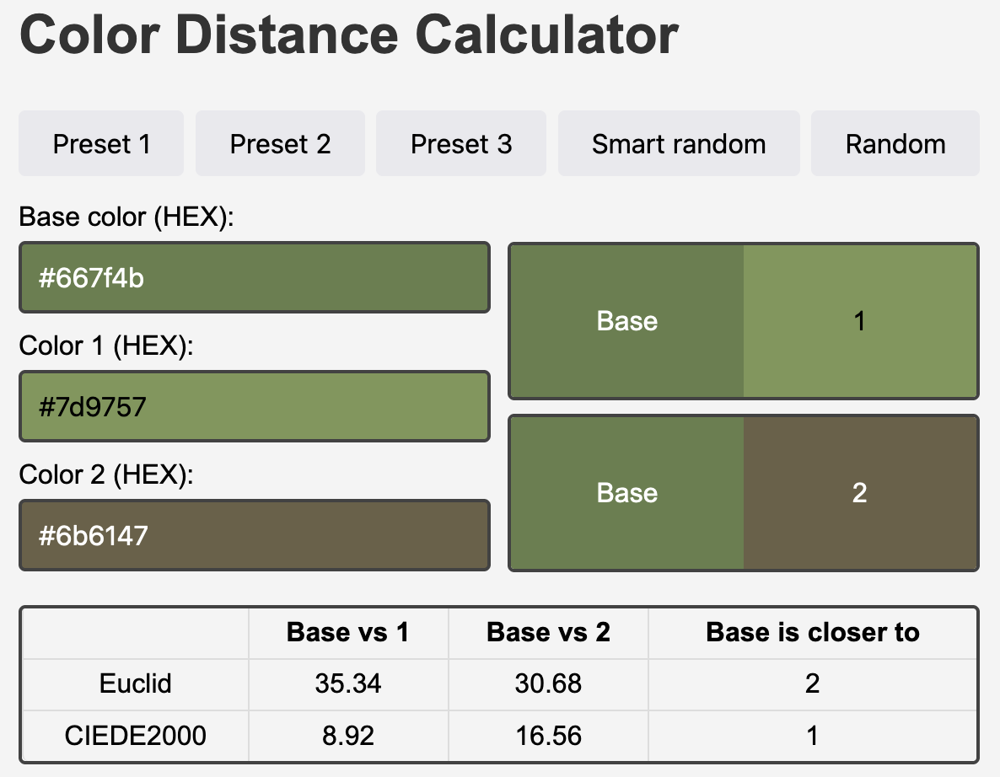

# Colordiff

I attempted to convert a video from full RGB to 16 colors (don’t even ask). I thought I was being clever by not using grayscale but instead searching for the closest color using some formula. (Spoiler: in the end, it only worked well with grayscale).

I assumed that the L2 metric on the R, G, B components would work perfectly, matching each of the original colors to one of my 16 colors. However, it turns out that colors perceived as similar to the human eye aren't always those that are closest according to Euclidean distance.

There are many different formulas and approaches for calculating color difference in a way that aligns with human vision. [CIEDE2000](https://en.wikipedia.org/wiki/Color_difference) works quite well (much better than Euclidean distance). But just take a look at the code ([colormath.js](colormath.js)).

# Site

  

I ended up creating a small tool that helps visualize color differences. It includes three presets: the first two demonstrate how Euclidean distance performs worse than CIEDE2000, and the third shows that both methods struggle to accurately identify similar colors.

There’s also a "random" button, which selects three random colors and calculates the metrics for them. Additionally, there's a "smart random" button. When clicked, it selects three colors where the Euclidean metric clearly fails from a human perspective. Of course, you can also manually input colors.

# Link

https://lll-phill-lll.github.io/colordiff/

